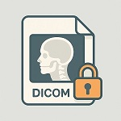

  
# medical-image-anonymizer
## Script to anonymize medical studies stored as DICOM.

To ensure that a DICOM image can be used for educational or research purposes in Uruguay without violating personal and sensitive data legislation, it is necessary to address both the national legal framework and the de-identification techniques defined in the DICOM standard.

---
